# 版本控制
重点！！！ Git和其他版本控制系统的主要区别在与对待数据的方法。其他大部分系统是以文件变更表的方式存储信息，将它们保存的信息是看作是一组基本文件和每个文件随时间逐步积累的差异。


Git 不按照以上方式对待或保存数据。 反之,Git 更像是把数据看作是对小型文件系统的一组快照。 每次你提交更新,或在 Git 中保存项目状态时,它主要对当时的全部文件制作一个快照并保存这个快照的索引。 为了高效,如果文件没有修改,Git 不再重新存储该文件,而是只保留一个链接指向之前存储的文件。


Git和其他一些分布式版本控制系统之间的一个关键区别是它们的数据模型。Git采用了一种称为"快照"或"快照存储"的数据模型，而不是存储文件的修改差异。这个数据模型在某些情况下具有一些优势：

1. **完整性和数据安全性**: Git的快照存储模型确保每个提交都是一个完整的快照，包括项目的所有文件。这意味着您可以信任存储库中的每个提交，因为它们都是完整的、可验证的。其他系统可能使用修改差异，这可能会导致数据的不完整性或丢失。Git的所有数据都会在存储前计算校验和，以校验和引用,机制叫做`SHA-1散列（hash）`。

2. **性能**: 快照存储模型可以提供更快的性能，特别是在处理大型文件和项目时。Git可以有效地进行快照的压缩和存储，而不需要存储每个修改的副本。这有助于提高性能和降低存储成本。

3. **分支和合并**: Git的快照模型使得分支和合并操作非常高效。因为每个提交都是一个完整的快照，所以分支只是指向不同提交的指针，而不是在文件级别上的差异。这使得创建和合并分支变得非常快速和低成本。

4. **本地操作**: Git非常适合在本地进行工作，因为您可以轻松地切换分支、查看历史记录和进行提交，而无需与中央服务器进行频繁通信。这使得离线工作和快速迭代变得更加容易。

5. **分布式开发**: Git的分布式性质允许开发者在没有网络连接的情况下工作，并且可以轻松地克隆、分支和合并存储库。这对于团队分布在不同地理位置的开发者来说非常有用。

### Git一般只添加数据

执行的 Git 操作,几乎只往 Git 数据库中增加数据。 很难让 Git 执行任何不可逆操作,或者让它以任何方式清除数据。 同别的 VCS 一样,未提交更新时有可能丢失或弄乱修改的内容;但是一旦你提交快照到 Git 中,就难以再丢失数据,特别是如果你定期的推送数据库到其它仓库的话。这使得我们使用 Git 成为一个安心愉悦的过程,因为我们深知可以尽情做各种尝试,而没有把事情弄糟的危险。更深度探讨 Git 如何保存数据及恢复丢失数据的话题,请参考撤消操作。

### 工作流程
基本的 Git 工作流程如下:
1. 在工作目录中修改文件。
2. 暂存文件,将文件的快照放入暂存区域。
3. 提交更新,找到暂存区域的文件,将快照永久性存储到 Git 仓库目录。


# 子模块的思想
子模块的思想是将一个仓库（通常是一个独立的项目或库）包含在另一个仓库中，以便在一个仓库中引用另一个仓库的特定版本。子模块功能强大，但有时被视为 Git 的复杂部分工具链。子模块在最高级别上是 Git 组合的工具存储库。

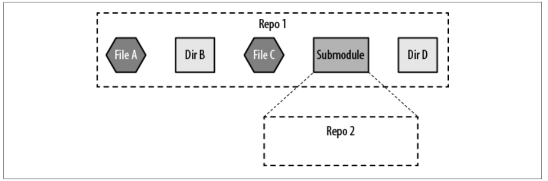

因为在存储库中，每个提交引用都有一个指向特定点的唯一标识符图表和导致该点的所有父状态，指向另一个的引用存储库在父项目的提交历史记录中记录了该精确状态。
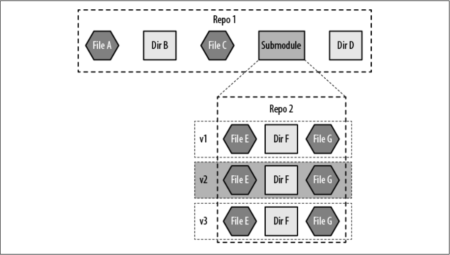

使用子模块背后最常见的驱动因素是模块化。子模块在缺乏此类源代码库的情况下提供源代码库的组件化二进制级别的模块化（DLL、SO）。比如C/C++的静态库和动态链接库: 在C和C++中，您可以创建静态库（.a文件）和动态链接库（.dll或.so文件），以将代码封装为可重用的模块。

Git 子模块有助于保留子组件的现有目录结构完好无损，前提是组件的分离沿着目录断层线，而实现对每个组件的精确标记和版本控制，从而有助于聚合项目。

1. 将子目录移出超级项目，成为超级项目的对等目录目录。如果维护存储库历史记录很重要，请考虑使用git filter-branch 帮助提取子目录结构。
2. 重命名 submodule-to-be 目录以更准确地表达子模块的性质子模块。例如，刷新子目录可能会重命名为 client-应用程序刷新插件。
3. 为子模块创建一个新的上游托管作为一流项目（例如，创建GitHub 上的一个新项目用于托管提取的代码）。
4. 将现在独立的插件初始化为 Git 存储库并将提交推送到新创建的项目托管 URL。
5.在超级项目中，添加一个Git子模块，指向新的子模块项目网址。
6. 提交并推动超级项目，其中将包括新创建的已添加 .gitmodules 文件。

它应该首先以独立的方式进行设计、测试和构建。然后，作为第二步，开发人员将焦点切换回超级项目，然后获取并检查子模块的较新版本。


## 使用子模块
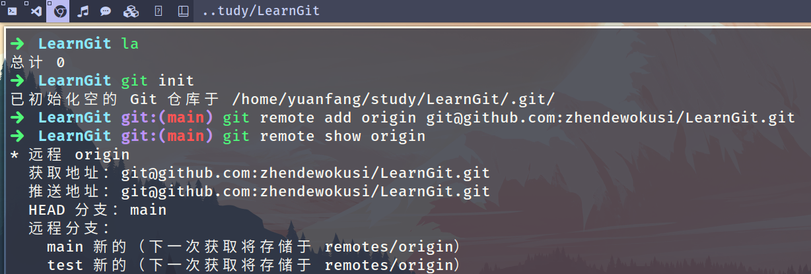
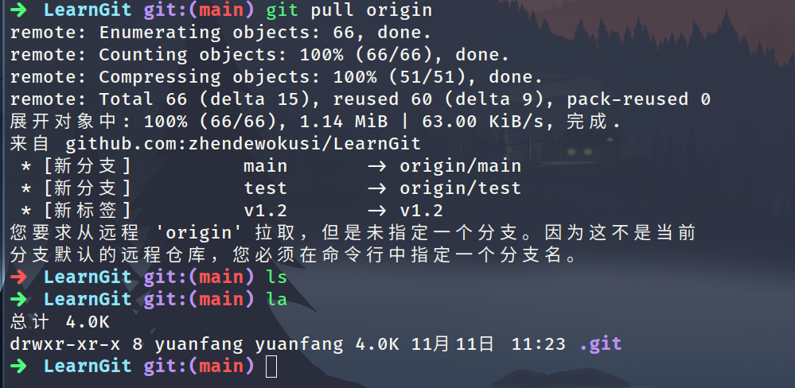
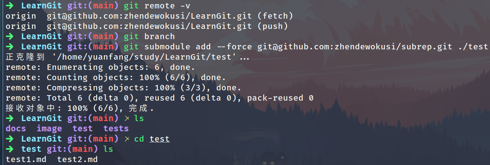


由于 .gitmodules 文件中的 URL 是人们首先尝试克隆/拉取的地方,因此请尽可能确保你使用的URL 大家都能访问。 例如,若你要使用的推送 URL 与他人的拉取 URL 不同,那么请使用他人能访问到的 URL。 你也可以根据自己的需要,通过在本地执行 `git config submodule.<文件名>.url <私有URL>` 来覆盖这个选项的值。 如果可行的话,一个相对路径会很有帮助。

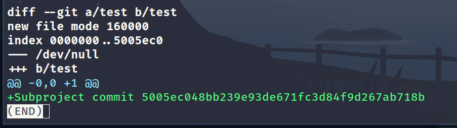
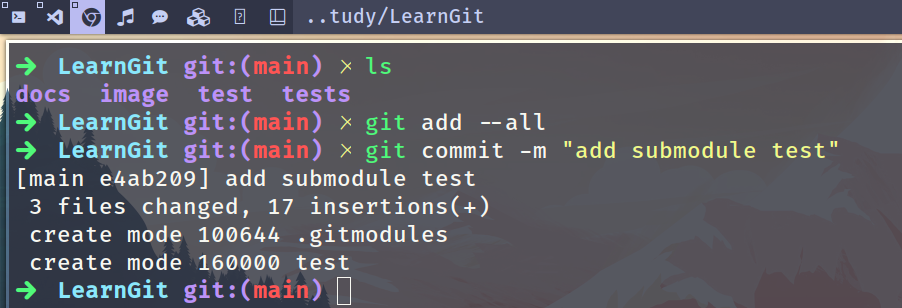

注意 test 记录的 160000 模式。 这是 Git 中的一种特殊模式,它本质上意味着你是将一次提交记作一项目录记录的,而非将它记录成一个子目录或者一个文件。

如果你想看更细致的差异输出，给`git diff`加上`--submodule`选项：

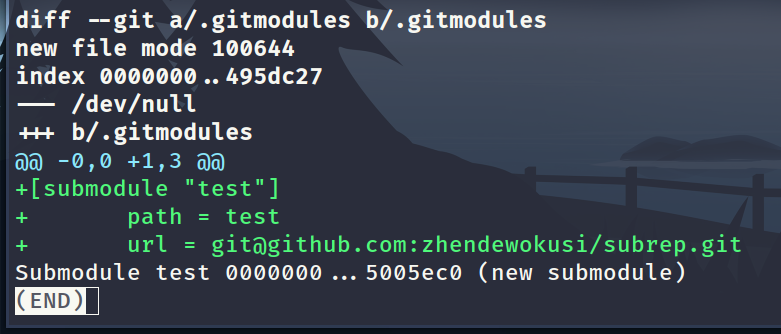

## 克隆含有子模块的项目

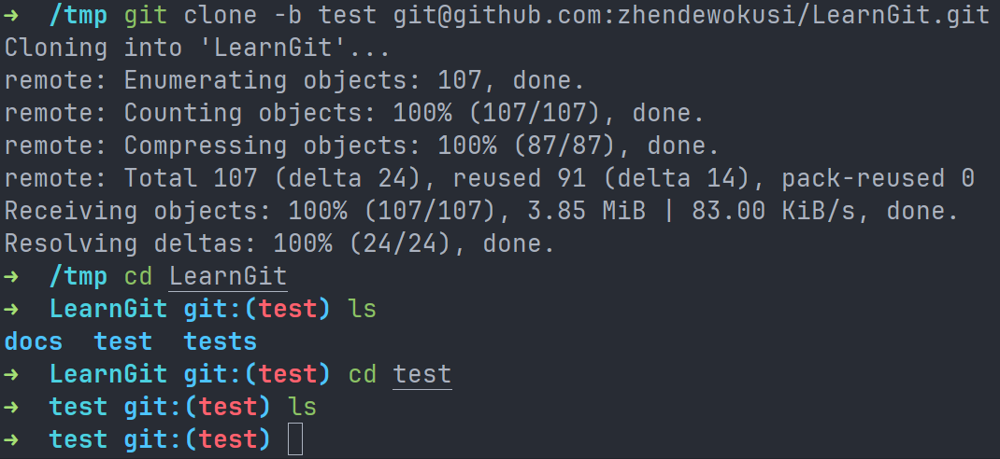
这里`-b`是指定克隆远程仓库的哪个分支，不设置的话就是默认分支。
可以看到目前`test`目录是空的，必须运行下面两个命令:git submodule init 用来初始化本地配置文件,而 git submodule update 则从该项目中抓取所有数据并检出父项目中列出的合适的提交。
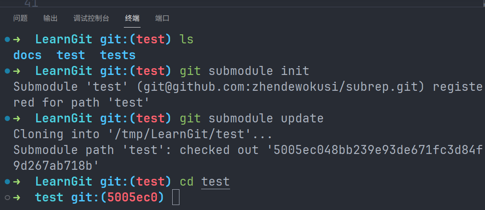
可以看到下面的`5005ec0`这表示当前的`HEAD`处于"detached HEAD"状态，而不是在分支上。这说明我切换到的是一个特定的提交而不是分支。如果要将其合并到main分支上，就需要`merge`。
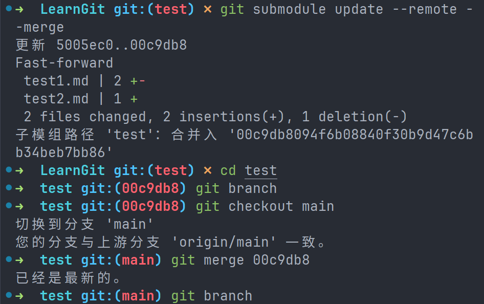

```shell
➜  LearnGit git:(main) ✗ git diff --cached
--cached           -- show diff between index and named commit
➜  LearnGit git:(main) ✗ git diff --submodule
--submodule  -- select output format for submodule differences
➜  LearnGit git:(main) ✗ git diff --submodule=
diff   -- show differences
log    -- list commits like git submodule does
short  -- show pairs of commit names
```


子模块（Submodule）和子树（Subtree）都是Git中用于管理多个仓库之间关系的工具，但它们之间有一些重要的差异，以及在何时使用的考虑因素。

**子模块 (Submodule)**:

1. **独立仓库**: 子模块是独立的Git仓库，它们具有自己的独立历史记录、分支和版本控制。每个子模块都有自己的.git目录。

2. **版本控制**: 子模块允许您将一个Git仓库嵌套在另一个Git仓库中，并且通常用于管理项目的外部依赖关系。您可以引入其他项目或库作为子模块，以确保项目的特定版本与外部项目的特定版本保持一致。

3. **仓库之间分离**: 子模块的更改不会直接影响主项目，因此它们的开发和维护是相对独立的。

**子树 (Subtree)**:

1. **嵌套目录**: 子树是将一个仓库的子目录嵌套到另一个仓库中的操作。在主项目的仓库中，子树看起来就像一个普通的目录，但它包含了另一个仓库的内容。

2. **版本控制**: 子树操作合并了两个仓库的历史记录，使得子树的更改直接影响主项目。子树更改会在主项目的提交历史中显示。

3. **紧耦合**: 子树操作在某种程度上创建了两个仓库的紧耦合关系，因为它们共享相同的提交历史。

**何时使用子模块**：

- 当您希望将外部项目或库引入您的项目，并希望能够独立管理它们的版本和更新时。
- 当您希望外部项目与主项目具有相对独立的历史记录和开发流程时。
- 当您需要跟踪和控制项目的依赖关系，并确保特定版本的依赖项与您的项目兼容时。

**何时使用子树**：

- 当您希望将另一个仓库的特定子目录嵌套到您的项目中，以便更方便地管理和维护这部分代码。
- 当您希望子树的更改直接影响主项目，而且希望它们共享相同的提交历史时。
- 当您需要在主项目和子树之间保持紧耦合关系，并且子树的更改在主项目中反映出来。


在Git中，子树（Subtree）操作是一种允许您将一个Git仓库的子目录合并到另一个仓库中的操作。**这使得您可以在一个仓库中包含另一个仓库的特定目录，而不是整个仓库**。子树操作可以在某些情况下用于管理项目的依赖关系或将外部项目集成到您的仓库中。

以下是一些子树操作的常见用法：

1. **添加子树**：要将一个Git仓库的特定目录添加为子树，可以使用以下命令：

```shell
git subtree add --prefix <prefix> <repository_url> <branch>
```

- `<prefix>`：指定子树的路径，即将子树合并到您的仓库中的位置。
- `<repository_url>`：子树仓库的URL。
- `<branch>`：子树仓库的分支。

例如，要将另一个仓库的 `src` 目录添加为子树，可以运行：

```shell
git subtree add --prefix src https://github.com/example/other-repo.git main
```

1. **更新子树**：要从子树仓库获取更新并将它们合并到您的仓库中，可以使用以下命令：

```shell
git subtree pull --prefix <prefix> <repository_url> <branch> --squash
```

这将获取子树仓库的最新更改，并将它们合并到您的仓库中，使用 `--squash` 标志将所有子树更改压缩成一个提交。

1. **推送子树更改**：如果您对子树进行了更改，并希望将这些更改推送到子树仓库，可以使用以下命令：

```shell
git subtree push --prefix <prefix> <repository_url> <branch>
```

这将把您对子树目录的更改推送到子树仓库的指定分支。

1. **分离子树**：如果您希望分离子树并将其变成独立的仓库，可以使用以下命令：

```shell
git subtree split --prefix <prefix> -b <new-branch>
```

这将从子树目录创建一个新分支，该分支包含子树目录的所有历史记录，然后您可以将该分支推送到独立的仓库。

请注意，子树操作可以复杂，特别是在处理多个仓库和多个子树时。在使用子树时，建议详细了解相关命令的选项和行为，以确保正确管理子树的变更。