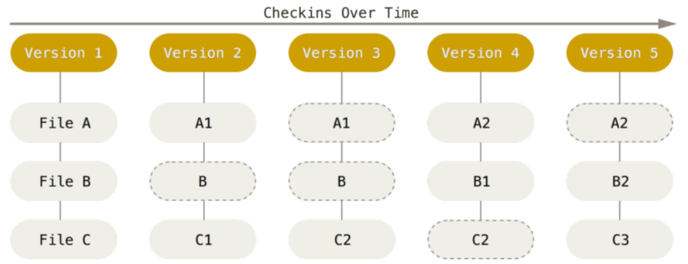

<!-- # 子模块
注意 DbConnector 记录的 160000 模式。 这是 Git 中的一种特殊模式,它本质上意味着你是将一次提交记作一项目录记录的,而非将它记录成一个子目录或者一个文件。 -->
## 版本控制
重点！！！ Git和其他版本控制系统的主要区别在与对待数据的方法。其他大部分系统是以文件变更表的方式存储信息，将它们保存的信息是看作是一组基本文件和每个文件随时间逐步积累的差异。
看图

Git 不按照以上方式对待或保存数据。 反之,Git 更像是把数据看作是对小型文件系统的一组快照。 每次你提交更新,或在 Git 中保存项目状态时,它主要对当时的全部文件制作一个快照并保存这个快照的索引。 为了高效,如果文件没有修改,Git 不再重新存储该文件,而是只保留一个链接指向之前存储的文件。 Git 对待数据更像是一个 **快照流**。

看图

### 近乎所有操作都是本地执行

你本地操作不需要联网，版本回退什么的都不需要联网，只需要在本地的git数据库存储,而不是联网从远程服务器拉取旧版本文件。
这也意味着你离线或者没有 VPN 时,几乎可以进行任何操作。 如你在飞机或火车上想做些工作,你能愉快地提交,直到有网络连接时再上传。 如你回家后 VPN 客户端不正常,你仍能工作。 使用其它系统,做到如此是不可能或很费力的。 比如,用 Perforce,你没有连接服务器时几乎不能做什么事;用 Subversion 和 CVS,你能修改文件,但不能向数据库提交修改(因为你的本地数据库离线了)。 这看起来不是大问题,但是你可能会惊喜地发现它带来的巨大的不同。

### Git会保证完整性

Git的所有数据都会在存储前计算校验和，以校验和引用,机制叫做`SHA-1散列（hash）`。

### Git一般只添加数据

你执行的 Git 操作,几乎只往 Git 数据库中增加数据。 很难让 Git 执行任何不可逆操作,或者让它以任何方式清除数据。 同别的 VCS 一样,未提交更新时有可能丢失或弄乱修改的内容;但是一旦你提交快照到 Git 中,就难以再丢失数据,特别是如果你定期的推送数据库到其它仓库的话。这使得我们使用 Git 成为一个安心愉悦的过程,因为我们深知可以尽情做各种尝试,而没有把事情弄糟的危险。更深度探讨 Git 如何保存数据及恢复丢失数据的话题,请参考撤消操作。

### 工作流程
基本的 Git 工作流程如下:
1. 在工作目录中修改文件。
2. 暂存文件,将文件的快照放入暂存区域。
3. 提交更新,找到暂存区域的文件,将快照永久性存储到 Git 仓库目录。

